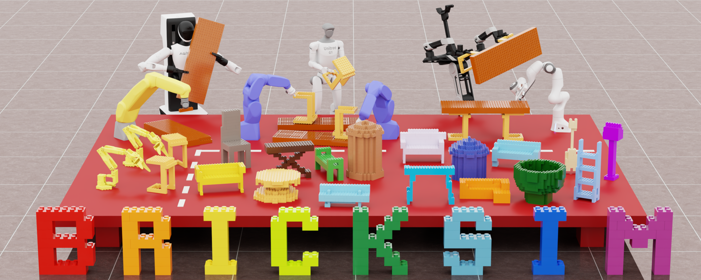

<div align="center">

# BrickSim
### A Physics-Based Simulator for Manipulating Interlocking Brick Assemblies

<p>
  <a href="https://broadcasts.cloudsmith.com/bricksim/bricksim"></a>
  <a href="https://arxiv.org/abs/2603.16853"></a>
  <a href="https://docs.isaacsim.omniverse.nvidia.com/5.1.0/index.html"></a>
  <a href="https://docs.python.org/3.11/"></a>
  <a href="LICENSE"></a>
</p>

<p>
  <a href="https://intelligent-control-lab.github.io/BrickSim/">Website</a> •
  <a href="https://arxiv.org/abs/2603.16853">Paper</a> •
  <a href="#quickstart">Quickstart</a> •
  <a href="https://www.youtube.com/watch?v=VGuHfz4yxLU">Video</a> •
  <a href="https://intelligent-control-lab.github.io/BrickSim/slides/">Slides</a> <i>(new)</i>
</p>

</div>

<p align="center">
  <a href="https://www.youtube.com/watch?v=VGuHfz4yxLU">
    
  </a>
</p>

## Quickstart

### Prerequisites
- x86-64 Linux platform. Support for other platforms is coming.
- Ubuntu 22.04+ or another Linux distribution with `GLIBC >= 2.35`, `GLIBCXX >= 3.4.30`, and `CXXABI >= 1.3.13`
- [`uv` package manager](https://docs.astral.sh/uv/getting-started/installation/)
- [`pixi` package manager](https://pixi.prefix.dev/latest/installation/) if you want to build the native extension from source
- A working NVIDIA driver compatible with [Isaac Sim requirements](https://docs.isaacsim.omniverse.nvidia.com/5.1.0/installation/requirements.html#system-requirements)

### Install from Source
We use `uv` for Python package management. If you don't have it installed, please refer to [Installing uv](https://docs.astral.sh/uv/getting-started/installation/).

```bash
# Install required tools (Debian/Ubuntu)
sudo apt install git wget unzip

# Clone the repository
git clone https://github.com/intelligent-control-lab/BrickSim BrickSim
cd BrickSim

# Download the prebuilt native extension to shorten setup time
./scripts/download_prebuilt_native.sh

# Alternatively, if you want to build the native extension from source, run:
#  pixi run build-native

# Set up the Python environment and install dependencies
uv sync --locked
```

### Install as a Python Package
You can install the `bricksim` package from [our nightly build registry](https://broadcasts.cloudsmith.com/bricksim/bricksim).
Note that the published Python packages do not include demos or experiment scripts.

```bash
uv pip install "bricksim[all]" \
  --index https://dl.cloudsmith.io/public/bricksim/bricksim/python/simple/ \
  --override <(printf 'pywin32==306 ; sys_platform == "win32"\n')
```

Or, if you want to add BrickSim to `pyproject.toml`:
1. Add the following override to your `pyproject.toml` (to mitigate Isaac Sim's dependency issue):
    ```toml
    [tool.uv]
    override-dependencies = [
      'pywin32==306 ; sys_platform == "win32"',
    ]
    ```
2. Add the `bricksim` dependency:
    ```bash
    uv add "bricksim[all]" \
      --index bricksim=https://dl.cloudsmith.io/public/bricksim/bricksim/python/simple/
    ```

### Run Demos
```bash
# Open an empty stage to play interactively
uv run bricksim

# Run the assembly demo
uv run bricksim demos/demo_assembly.py
```

Other demos include:
- `demos/demo_inhand.py` for in-hand manipulation experiments
- `demos/demo_keyboard_teleop.py` for keyboard-driven interaction
- `demos/demo_teleop.py` for teleoperation, recording, and replay workflows
  - The teleoperation demo expects the `lerobot` package plus a configured leader device path inside `demos/demo_teleop.py`.

## Development

### Repository Layout
| Path              | Purpose                                       |
| ----------------- | --------------------------------------------- |
| `native/`         | C++ native extension                          |
| `python/`         | Python extension and API                      |
| `demos/`          | Demos                                         |
| `experiments/`    | Research and evaluation scripts               |
| `resources/`      | USD files and other assets                    |
| `scripts/`        | Development and build scripts                 |

### Generating Type Checker Configuration

Generate the ty configuration for type analysis and completion in editors like VSCode:
```bash
uv run bricksim-type-configs
```

We recommend installing the [ty extension](https://marketplace.visualstudio.com/items?itemName=astral-sh.ty) for VSCode auto-completion, as it's much faster at handling Isaac Sim's many dependencies.

### Building the C++ Extension
If you make changes to the C++ code in `native/`, you need to re-compile the native extension for the changes to take effect.

```bash
pixi run build-native

# To also build & run the tests, use:
pixi run test-native-debug
pixi run test-native-release
```

## Citation
If you use BrickSim in your research, please cite:
```
@article{wen2026bricksim,
    title = {BrickSim: A Physics-Based Simulator for Manipulating Interlocking Brick Assemblies},
    author = {Wen, Haowei and Liu, Ruixuan and Piao, Weiyi and Li, Siyu and Liu, Changliu},
    journal = {arXiv:2603.16853},
    year = {2026},
    eprint = {2603.16853},
    archiveprefix = {arXiv},
    primaryclass = {cs.RO},
    url = {https://arxiv.org/abs/2603.16853}
}
```

## Attributions
<a href="https://cloudsmith.com"></a><br>
Package repository hosting is graciously provided by [Cloudsmith](https://cloudsmith.com).
Cloudsmith is the only fully hosted, cloud-native, universal package management solution, that
enables your organization to create, store and share packages in any format, to any place, with total
confidence.
